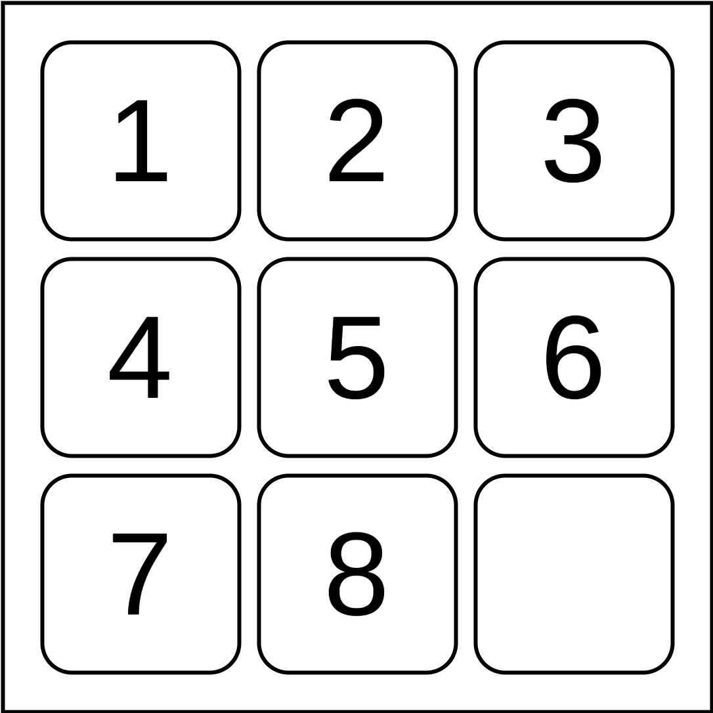
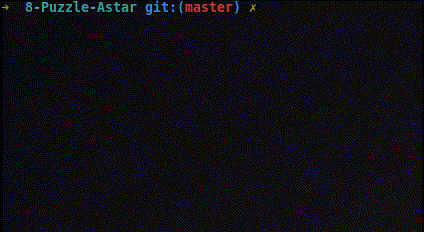

<h1 align="center">Solving Eight Puzzle using Astar algorithm.</h1>

<p align="center"> 
  
</p>

## Environment
<p align="justify"> 
  
  <a>This project has the purpose of elucidating in a graphic way the functioning of the pathfinding algorithm A* in a Eight Puzzle environment.</a>  
</p>
  

## Setup
<p align="justify"> 
 <a>All of requirements is satisfied having Python 3+ installed.</a>
  
 <a>To execute the code just use:</a>
</p>

```shell
python3 puzzle.py
```

## Objectives
<p align="justify"> 
  The goal of the eight puzzle is to align all eight values in a serial form. Starting with an order in which the user has total control we can see in the image below the algorithm looking for the best way among a finite space of possibilities, as to align all the numbers in the correct order.
</p>

<p align="center"> 
  
</p>  

<p align="center"> 
  <i>If you liked this repository, please don't forget to starred it!</i>
  
</p>
